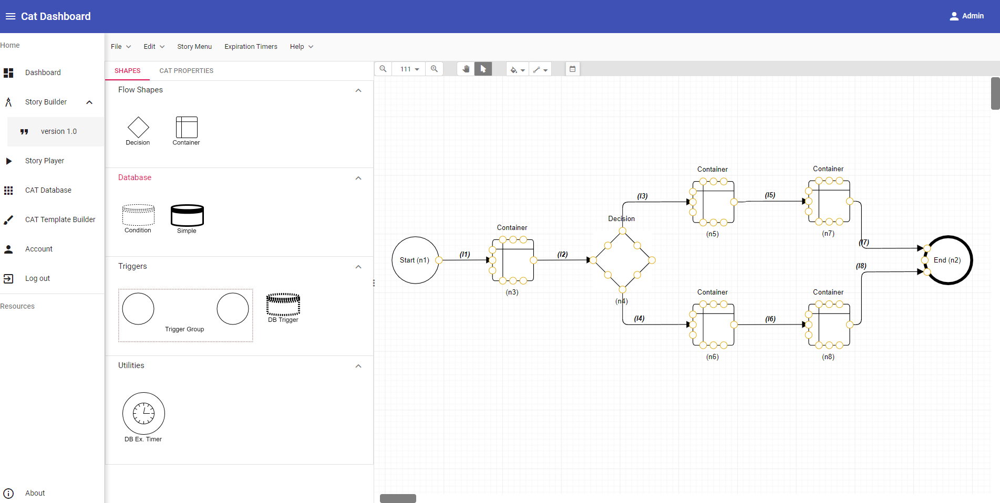
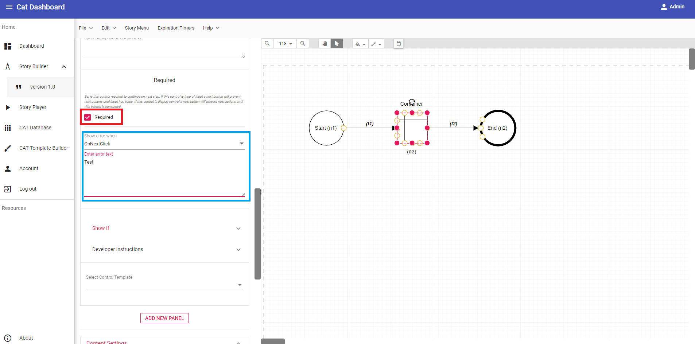
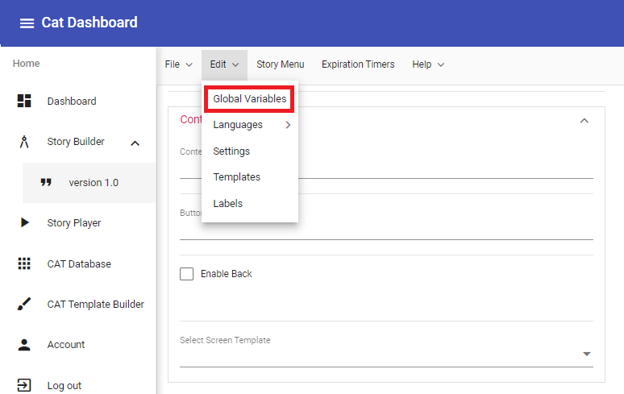
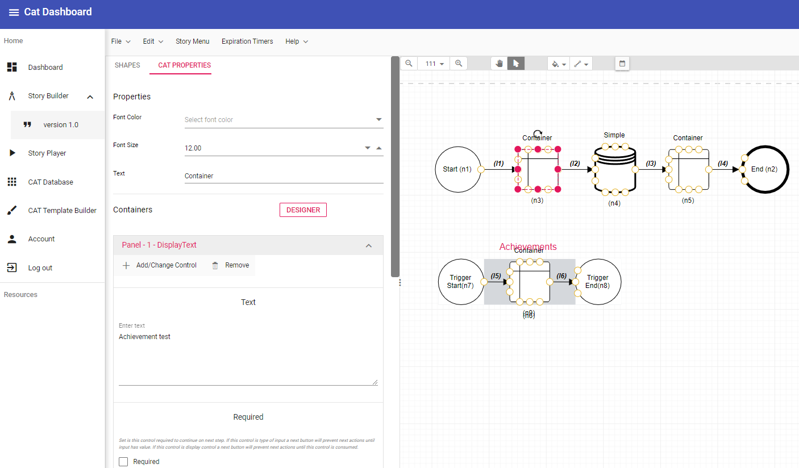
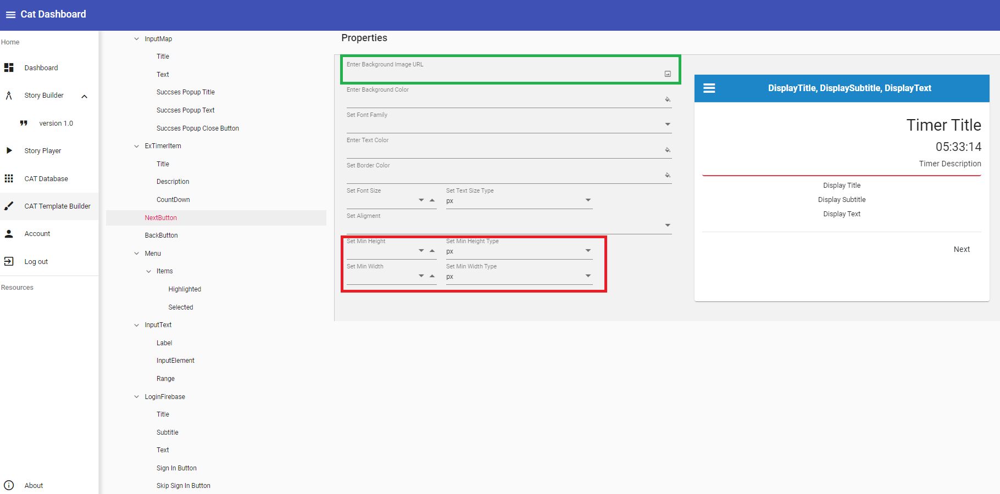

# **Introduction**  
Welcome to the documentation for CAT (Creative Academy Toolkit)! The goal of this documentation is to explain all the features of this program and give you some valuable tips on building your applications.

This documentation is organized into a few key sections:  
**1. The Basics** is a section that contains overview of CAT's simpler elements and teaches you how to build your first, simple app.  
**2. Guides** is a section that contains guides and tips that aren't considered to be basics anymore.  
**3. Reference** is a section that contains explanations on the Elements of User Interface, Options and Shapes.  

# **1. The Basics**  
### **1.1. How to begin?**  
CAT works best in Google Chrome without any addons. To start building your app, click on Story Builder and then on version 1.0 (framed red on the image below).  

This will show you all the Shapes used to build the diagram on the left side of the screen and a "working surface" on the right (to zoom in and out, place your pointer over the "working surface, and use your mouse wheel while holding Ctrl). When you start building a new app, you will always start with two nodes on your "working surface" - those nodes being Start and End (in red frame on the image below).  

We'll talk more about those two nodes later. To begin building your app, simply "drag" one of the Shapes from the left part of the screen onto the "working surface".

### **1.2. Your first simple app**  
Now that you've learned a bit about shapes, we can begin building your very first, simple app. To begin, let's drag a "Container" shape onto the "working surface" (see image below).  

Now that we have a "Container" shape, simply click on it and choose "Cat properties" option on the left side of the screen, right above the Flow Shapes (framed red on the image below).

After that, click on the "Panel 1" and than click on "Add/Change Control". A menu will appear with all the options that you can use the "Container" Shape for. For the purpose of this first, simple app, choose DisplayText option (framed red on the image below) and click "Ok".

When you have done that, write something in the "Enter text" space (framed on the image below).
  
Now that we have our text, the only thing we have to do is connect our "Container" node to the "Start" and "End" nodes. Every app has to have it's first node connected to "Start" and it's last node to "End". To connect nodes, first hover over the small circle on the "Start" node with your pointer until the pointer turns into a +. After that, press and hold your left mouse button and drag the arrow towards one of the small circles on the "Container" node. When that is done, all that is left is to connect the "Container" node to the "End" node. We will repeat the process from before - hover over one of the small circles on the "Container" nodes and when your pointer turns into a +, click and hold your left mouse button while dragging the arrow towards one of the small circles of the "End" node. On the image below you can see how your final diagram should look like.
  
Now the only things left are to check if there are any errors and if your app works correctly. To do that, we will first go to Help and choose Check Diagram Errors.  
  
If you've followed this guide, you should get a message saying "Everything looks fine, good work!". Now we can Check Web Demo (you can find it in Help). When you choose the option, you should get a screen that looks like the image below. Now simply click on the Play button above "Start your story!"  

There you go! This is your first, although very simple, app! To go back to your Diagram, click on Story Builder > version 1.0 . Now to save the app, we go to File and choose the Save option (see image below). This will download a .json file to your device that you can use to open this Diagram again. You will recognize those files by their name - it begins with Cat-Diagram. It is recommended to, from time to time, choose Save in Browser option, especially if you're working on bigger apps. 
  
We have one more thing left to do. Go to Help and choose the option Export for developer use. Keep in mind that this is only for developer use and you won't be able to open it in CAT. You will recognize those files by their name - it begins with Cat-Builder.
  
You'll have to upload Cat-Builder .json files to a server, since your app will download it during startup. This allows you to make changes on your Diagram and have the changes immediately be visible.

# **2. Guides**  
In this section, you can find guides on how to do a bit more complex things in CAT.   

### **2.1. Choices - Decision node and InputSelect option**  
This part of section 2 will teach you how to make branching choices in your app. To begin, let's first drag 5 Container nodes and 1 Decision node onto the working surface and connect them.  

After you've done this, click on the first Container node (the one connected to Start, named (n3)) and on Panel 1 in Add/Change Control choose InputSelect.  
  
Now we have to do a few things. In the red-framed section on the image below, we can add a title and a question. In the green-framed section on the image, we can choose whether users of the app are required to make a choice or if they can continue on without making it (if they aren't required to make a choice, "un-check" the Required checkbox). If you make the choice to be required, you can choose when the Error Text will appear. You can make it to always appear or you can make it to appear when users try to proceed without choosing an answer (if you want it to work like this, for "Show error when" choose "OnNextClick"). Also take a note on the text in the small, black frame. This is where you can see numbers of the nodes - they'll be important in the later steps. When you have done this, click on the + icon (framed purple on the image below).  

This is where we add choices. "Text" is an option that will appear to the users of the app, while "Value" is just as it's name says - a value we give to that choice. Add two choices in total before we proceed. (In this example, they are named "Choice 1" (that has Value 1) and "Choice 2" (that has Value 2))

After that's done, click on the Decision node and in "Cat Properties" click  "Add New Group" (framed green on the image below) button. When you do that, you'll see a screen same to the one on the image below. We'll first set a default Connector (framed red). Here you'll choose which node the user is going to be taken to if they press next without making a choice, but only if you didn't mark the "Required" checkbox (framed green). When it comes to the "Required" checkbox, if you mark it, you also have to write an error text in the space below it. Now let's start explaining what you'll find in the orange frame. Below "Condition 1" you'll notice dropdown menu called "Select Global Variable". Here you have to select a variable from the list. In this case, you will choose N(3) control InputSelect(1) - input value (17) - this will tie the decision node to the "InputSelect" where we set up our two choices. In the drop down menu called "Select condition operand", choose "Equal" of "Value" and in the space where it's written "Enter condition value" put 1 (since in InputSelect for Choice 1 we've marked Value 1.) and at "Go to: Select condition connector" dropdown menu, select (l3). If you do that, than when user selects Choice 1 in the menu, the application will lead them to (n5). 

Repeat this process once more, but this time in the "Value" bracket put 2 and in "Go to: Select condition connector" dropdown menu, select (l4). If you do that, when user select Choice 2 in the menu, the application will lead them to (n6). If you did everything correctly, your screen should look like the one on the image below.

The only thing left to do is to add some text to the rest of the nodes. For example, you can add "Choice 1" to (n5), "End 1" to (n7), "Choice 2" to (n6) and "End 2" to (n8) and test the app. To see how to add text, check your diagram for errors and test the app, see "**1.2. Your first simple app**" section of this user documentation. 

### **2.2. How to add Image Gallery, Video and Audio**
This part of Section 2 will teach you how to add Image, Video and Audio to your app. To start, we'll need 3 Container nodes. 

Select (n3) and in Cat properties on Panel 1 Add/Change control, choose "GalleryImage". When you do that, your screen should look like the image below.

In the part that's framed red, you can add a title and text for your Gallery Image if you want. To begin adding image, select the + button framed blue. After you do that, a screen that looks like the one on the image below will appear.

In the space below "Name", write a name for the image (it won't be shown anywhere, so you can just put 1 there). In the space below "Url", paste a link to the image. This will probably be a link to an image that you have previously uploaded to your online storage. Remember to set the image to "Public" because otherwise it won't appear. When you're done with the naming and the Url, press "OK", and you're done. Now an image will appear on this node. You can make an image gallery by continuing to add other images by pressing + and repeating this process. Adding Video and Audio works in exactly the same way.

### **2.3. How to add Maps**  
This part of Section 2 will teach you how to add Maps to your app. You'll need to use this function if you want to make an application that requires the users to visit certain places before they're able to proceed. To start, we'll need one container node. Select the node and in Cat properties on Panel 1 Add/Change control, choose InputMap.

When you do that, you should get a screen that looks like the one on the image below.

You can add name of the map and text in the space framed purple on the image above. To navigate the map, move your pointer above it and use your mouse wheel to zoom in and out. You can move around the map by holding your left mouse button pressed and dragging the map. When you find a location that you want, press left mouse button on it and a blue circle will appear. You are going to be able to see the coordinates of the location you've selected above the map (framed green on the image above). You can set up how close the user of the app needs to come to the location you've chosen to be able to proceed by determining the radius (framed red on the image above). If you want a pop-up message to appear when the user reaches the location, you can set it up by marking "Show Success Message" (framed blue on the image above). If you don't want the user of your app to be able to proceed before reaching the location on the map, you can mark "Required" checkbox (framed red on the image below) and choose whether you want the error text to appear when they press "Next" button or if you want it to be always shown on the screen (framed blue on the image below). 

And you're done! 

### **2.4. Shaping the Screens - Designer**  
This part of section 2 will teach you how to shape the screens of your applications. For this, we'll need one container node with 3 panels (framed red on the screen). In this example, we're using DisplayTitle, DisplayText and GalleryImage. 

When you make the panels, press the "Designer" button. Your screen should look like the one on the image below. What you see on the screen are the sizes of each of your panels - it's how much of the screen each of them will take. To start resizing them, move your mouse pointer above the bottom right corner of the panel (framed red), hold your left mouse button and start move it towards the left side of the screen. 

Panels come in 3 possible sizes (showed on the image below).

On the image below, you can see approximately how much space each panel takes. DisplayTitle was used for the example.

### **2.5. How to use Timers**  
This part of section 2 will teach you how to use Timers. For this, we'll need 3 container nodes, 3 timer nodes and 1 condition node.

When you connect all the nodes, select the first timer node and Cat Properties. When you do that, you'll see a button "Add Expiration Timer". When you select it, you should see a screen that looks like the one on the image below.

The most important part on this screen is the one framed red. Here you'll choose whether you want the timer to start counting towards zero or from zero. In this example, we'll use "Descending", to set a time limit. Now that we've added the timer to our app, the next time you select any of the timer nodes you'll see a button called "Add Action". Let's start with the first timer (n4).

Since this is the first timer in our application, in the "Set Action Timer" (framed red on the image below) dropdown menu, we'll choose "Start". For "Set Instance of Expiration Timer Item" (framed green), we'll select the timer that we've made in the previous step (Test Timer). Now the only thing left in this step is to determine how much time users of the app will have to complete it. Keep in mind that you're entering the number of seconds here. ("Set Expiration Timer Interval in seconds", framed purple) Before we proceed, let's first add panels to all the non-timer nodes. The first node (n3) in this example only has a DisplayText panel. (image below)

The second node in this example (n5) has an InputSelect panel with two options (image below). The first option will lead the user to the end of the app, and the second option will loop back to the InputSelect node and deduct 30 seconds from the timer (we'll set this up a bit later).

Decision node will bring the user to (n9) if they choose the first option and to (n7) if they choose the second option. (setup of the node on the image below) If you decide to make the choice required, don't forget to input an error text. 

Node (n7) has only a DisplayText panel and is connected to the second timer in this example (n8).

The last non-timer node in this example also has only a DisplayText panel.

Now that we have set up all the other nodes, let's go back to timers. Select the second timer (n8) and press "Add Action". In "Set Action for Expiration Timer" drop down menu (framed red on the image below), select "Addition". After that, in drop down menu for "Set Instance of Expiration Timer Iterr" (framed green) select the timer that we've made in this example (Test Timer). With this function, you can either add time to the timer or deduct it. If you want to add time, input a positive number, and if you want to deduct time, input a negative number to "Set Expiration Timer addition or substraction of interval in seconds" (framed purple on the image below).

After you've done this, select the last timer (n10) and press "Add Action". In "Set Action for Expiration Timer" drop down menu (framed red on the image below), select "Stop". After that, in drop down menu for "Set Instance of Expiration Timer Iterr" (framed blue) select the timer that we've made in this example (Test Timer). When the user reaches this node in the app, the timer will stop.

And we're all set! The only thing left is to test the app. First go to "Help" drop down menu and select "Check Diagram Errors". If you did everything correctly, you'll have no errors and you'll be able to "Test Web Demo". 

There are 2 more functions when it comes to timers - those functions are "Pause" and "Resume". They are useful if, for example, you want the users of the app to read a longer text before answering a question. To utilize those two functions, simply put a timer node with "Pause" function selected before the node that you want the timer to be paused on. To resume the timer, just put a Timer node with "Resume" function before the node you want the timer to start on again.

### **2.6. Data Upload**  
This part of section 2 will teach you about Data Upload (Image, Text and Geolocation). To begin, we'll need 3 Container nodes.

We'll begin with File upload. Select the first node (n3) and in Cat Properties, change the first panel into FileUpload.

When you've done this, you should see a screen that looks like the image below.

In the part framed red, you can add Title, Text (description) and Button upload text. This part is optional, but it's recommended to add text at least for the button. In this example, we'll write "Upload" for the text of the button. In the part framed green, you can set the minimum and maximum number of files that can be uploaded at one time. In this example, we'll leave it empty. Here you also choose the File Type (at this point, there is only "Image" to choose). When you choose the File Type, you'll be able to input "Shrink Image" value. As you'll see in the recommendation in CAT, 500kb is a recommended image size. The next option you'll see is "3. Destination". Here you can select a server onto which you want your images to be uploaded to. In the part framed purple, you can add a File Path for your files. In this example, the File Path is "Test" and it's type is Text. Now we need to create a manual variable. To do that, go to "Edit" dropdown menu and select "Global Variables" option (see image below).
    
When you do, you should see the same screen as the one on the image below.

To begin, select press "Add" button (framed red). Now we need to give a name to our variable (framed purple). In this example, the variable is named Test Image Upload.  When you've named your variable, you have to select it's type from the drop down menu framed green. Choose "String" here. Press ok and you're done! Now, we have to create a label. You can do this in the same drop down menu where you chose "Global Variables" options. When you hover over "Edit" with your mouse pointer, you'll see the option "Labels" at the bottom. Select it and press "Add". To create a "Label", you just have to give it a name and press "OK". When you're done, your screen should look like the one on the image below.

Now there is only one thing left to do to enable our Image Upload. Select the first node (n3) and scroll all the way down in CAT Properties until you see "Enable Data Upload" check box (framed red on the image below). Mark it and for "Select Data Upload Type", select CAT Database. Now press "Add" (framed green on the image below) and from the "Select Global Variable" drop down menu, select the variable that we made (Test Image Upload) and for the label, choose "Test_Upload".
  
And you're done!

Now, let's see how to upload Text. "InputText" function is used when, for example, you want the users of your app to leave comments or answers for some questions. Select second container node (n4) and change the first panel into "InputText" (see image below).
  
When you do that, you should see a screen that looks like the one on the image below. In the part framed red, you can add label text and placeholder text. Although it's not required, it's recommended to add a placeholder text. In this example, we'll add "Input Text Test". Now we need to choose Input Type (framed green). You have a few options here, so you can choose them depending on what you need for your app. In this example, we'll choose "Text". 
  
When you've done this, we'll create a "Global Variable" and a new label (see images below). 

Now the only thing left to do is to "Enable Data Upload" and choose our new variable and label.

And we're done!

Now, let's see how to add "InputGeolocation" function. Select the last Container node (n5) and change the first panel into "InputGeolocation".

You should see a screen that looks like the one on the image below.
  
"InputGeolocation" will let users of your app to either put a pin somewhere on the map or to mark their current location. Now we'll create another "Global Variable" and label for this function.

Now the only thing that's left is to enable Data Upload and choose our new global variable and label.

And you're done. Don't forget to un-check "Required" check box if you want those functions to be optional. You can now Check for Diagram Errors and test your app.

### **2.7. Be Mindful of Space**  

Although you have quite a lot of space on the Dashboard, you should still be mindful of how you use it. If you're making bigger apps, you will soon run out of space if you're not careful. The image below shows how much space you have for your diagram.
  
The images below show you a few examples on how to conserve space.

### **2.8. Adding another language**  
This part of section 2 will teach you how to add new languages to your app. Since languages are hard-coded, we'll use English and Croatian. We'll use one container node in this example (see image below).  
  
Now that we have our container node and example text, let's add a new language to our app. To do this, go to "Edit", "Languages" and from the menu there select "Config. Languages" (see image below).
  
When you do that, your screen should look like the one on the image below (you'll probably have different languages offered). In this example, we're going to choose "Hrvatski" and press "Ok".
  
When that's done, we're again going to select "Edit", "Languages" and choose "Export to CSV".  
  
On the next screen, we're going to select "Hrvatski" and press "Ok". At this point, a download of a document named "Cat_Export_Languages-en-US-to-hr-HR" will start. Once it's done, open it.  

The part of the table framed right tells you what information each row below it contains. Starting from left to right, the first row represents the number of the node. If you need to add or change some translations, you can just remember the node your wanted text is on and easily find it, since the nodes will be listed in order. Since we have only one node in our app, there is only node (n3) (framed green). The second row represents panel on the node. The third row contains information about the original language the text was written in. The fourth row contains text written in the original language. Note the area framed orange - everything there is hard-coded, so that's why it appears in the table although you can't see it in the app. The The fifth row contains information about the new language (in this case Croatian) and the sixth row is a space where you write the translation. You'd write the translation of the text we entered into the app into the box framed purple. When you're done with inserting the translation, save changes. Now the only thing that's left is to import the translation into the app. You do it by selecting "Edit", "Languages", "Import from CSV" (see image below). Choose which language you want to import the translation for (in this case "Hrvatski"). And we+re done. Now, to see how to change the language in your app, consult part 2.8.

### **2.9. Utilizing Database Nodes**  
There are two types of database nodes in CAT - Simple Database Node and Condition Database Node. Simple node changes one variable into another, while Condition node changes a variable into another only when a certain condition is fulfilled. We'll continue our example from section 2.7. We'll need one more container node and one condition node to proceed (see image below).
  
The first node (n4) contains "InputSelect". In this case, the title for the choice is written in English and Croatian. In "InputSelect" (framed red), we'll give English language value of 1 and Croatian language (Hrvatski) value of 2. When that's done, let's proceed to the condition node.

When you select the condition node, press "Add New Group" button, and you should see a screen that looks like the one on the image above. In the red-framed part, for "Global variable" we'll choose "N(4) control InputSelect(1) - input value (11)" (because that's the global variable that represents our InputSelect function on node 4). We'll set "Condition operand" to "Equal" and "Value" to 1 (English language). In the green-framed part, for our "Global variable" we'll choose "Selected_language (1)" and for "On Value"  part we'll select "English". If you've done everything correctly, your screen should look like the one on the image below.  
  
Now we'll repeat the same process for Croatian language - the only difference will be the value (see image below).  
  
And we're done. Now the language of the app will change depending on your choice on the first screen. If you choose English, you'll see a sentence in English on node (n3), and if you select Hrvatski, you'll see a sentence in Croatian. You can check your app for errors and test it in Web Demo. Condition node isn't limited to only changing languages - it can change any variable into another variable as long as the condition has been fulfilled. 

Now let's proceed to Simple node. We'll use language as example again.   
  
If we replace Condition node with a Simple node and set it up in the same way like the image above, than no matter what you choose on n4, the language will be changed to Croatian (Hrvatski). There doesn't even have to be "InputSelect" on n4, since everything after n4, no matter it's content, will change to Croatian language. We'll talk more about Simple nodes in the section about adding Achievements.

### **2.10. Advanced Panel Control - Show If**  
This part of section 2 will teach you about Show If function on panels. Show If is useful if you want to set a certain condition for panels to appear. In this example, that condition will be a selected language. We'll need 2 Container nodes and 1 Condition node. On node (n3) we'll have InputSelect that will let the user choose a language.  
  
You should set up your Condition node in the same way that's shown on the images below.  
  
  
  
When that's done, let's proceed to our last node and Show If function. In this example, we'll use 2 DisplayText panels. The first panel should look like the one on the image below.  

In the part of the panel framed red, you should write a sentence in English. When it comes to the part framed green, for "Select Global Variable" we'll choose "Selected_language 1". For "Select condition operand", we'll choose "Same", and for "Select condition value", we'll choose "English" (see image below). This means that if the selected language is English, this panel will show.  
  
The process is the same for the second panel, but we'll write a sentence in Croatian and for "Select condition value", we'll choose "Hrvatski" (see image below).  
  
And we're done. Now the panels that will be visible to the user will depend on the language that was selected.

### **2.11. Creating a Sidebar**  
This part of section 2 will teach you how to make a sidebar. To begin, we'll create 2 Container nodes that will contain only DisplayText panel with "Test node 1" on node (n3) and "Test node 2" on node (n4) text.  

After that, we have to create a Story Menu. To do this, select "Story Menu" (framed red on the image below) and than select "Create New Menu".  
  
When you're done, select "Main Story - Id: 1" and press "Edit" (framed red on the image below).  
  
Now you should see a screen that looks like the one on the image below.  
  
We can leave name of the item to be "Main Story". Now, we need to add text to the field framed green. For this example, we'll just write "Test Story". If you want this part of the sidebar to have an icon, you can post a link to the icon you want to the field framed purple. When it comes to the part framed red, here you can decide whether you want this item to be visible, enabled or highlighted in the sidebar. For this example, we'll leave check boxes as they are. When you're done with this, we'll create a "Trigger group" and add one Container node to it (see image below).  
  
Now we'll rename our Trigger group to "Sidebar test 1" and add one DisplayText panel to the Container node (n6) inside our trigger group.  
  
  
When that's done, we'll go back to the "Story Menu" and select "Add parent".  
    
When you do that, your screen should look like the one on the image below.  
  
In the part framed red, we can write "Test Sidebar 1" in the "Name of the item" field and "Test" in the "Text of the item field". In the part framed green, we'll select "Trigger - Sidebar test 1", since that's the name of the trigger group we made. It's recommended to name every trigger group you make, as it will make creation of the sidebar easier. In the part framed purple, we can leave everything as it is. If you've done everything correctly, your screen should look like image below.  
  
And we're done. If you want to add more items to your sidebar, you'll have to repeat this process for all of them.   
  
### **2.12. Adding Achievements**  
This part of section 2 will teach you how to add achievements to your app. To begin, we'll need 2 container nodes, 1 simple node and 1 trigger group with a container node.  
  
To the first two container nodes (n3) and (n5) we'll add just a "DisplayText" panel and write "Achievement test". We'll name our Trigger Group "Achievements" and add an "ImageGallery" panel to the container node (n7) inside it. Before we proceed, we'll first create a sidebar (Story Menu) (see section 2.10. to learn how to do it). When that's done, we'll "Add parent" (it should look like image below).  
  
When that's done, we have to create a Global Variable. To do that, select "Edit", "Global Variables" and "Add".  
   
  
We'll name this variable "Trophy" (framed red on the image above) and we'll set the variable type to "Boolean" (framed green on the image above). Boolean is a type of variable that has two states - true and false. When that's done, press "Ok" and select your Simple node. For "Set Variable", we'll choose "Trophy" variable we've just made, and for the "Value", we'll choose "True" (see image below). This means that after the user passes (n3) in your app, the state of our "Boolean" variable will turn to "True". This is important for our next step.   
  
Now, select the Container node in the trigger group and add an item to the "GalleryImage". We can name it "Test", and "URL" should lead to an icon you want to use for your achievement. When that's done, select "Show If". For the Global Variable, we'll choose "Trophy" and for the Condition operand, we'll select "Same" (framed red on the image below). Set "Condition value" to "True" (framed green on the image below).  
  
Because we've set "GalleryImage" like this, the icon for your trophy/achievement will not show in the sidebar until the user of the app doesn't get to node (n5). And we're done. If you want to add more achievements, you just need to create more Global Variables (remember to set them to "Boolean") and more Simple nodes that will change their state to "True". You'll also have to create a new "ImageGallery" panel for every additional achievement.  

### **2.13. Templates**  
This part of section 2 will teach you how to make and apply templates. Templates allow you to change the font, colour and the size of the letters, to add icons for "Next" and "Back" buttons, to add a background image and to add icon for the sidebar. To put it simply, you can change and regulate every part of the design of your app with templates. To begin creating a template, select "CAT Template Builder" option in the side menu on the left side of the screen (see image below).  
  
We'll begin with the "Root" section. (framed red on the image below)  
  
Let's analyse "Properties" part of the screen. The first part, "Enter Background Image URL" is where you put a link to the background image you want to be shown in your app. "Enter Background Color" will change the colour of the background. "Set Font Family" lets you choose between the available fonts. "Enter Text Color" lets you change the colour of the font. Keep that in mind when choosing a background, since the users should be able to read the text in your app clearly. "Set Text Aligment" lets you choose aligment for the text in the app. "Set Font Size" lets you adjust the size of your font. The size of the font can be measured in px, dp and sp (you can choose this in "Set Text Size Type"). "Set Text Style" lets you choose between Italic, Bold and Underline. As you can see on the left size of the screen, you can adjust all of this for every function of the app. You can see the changes as you make them if you click on the "Start your story!" screen (framed green) and pressing "Next". The story will be played in order, from top to bottom (from "Root" to "Thumbnails"). You can always see which part of the Template the story is playing at every moment (framed red on the image below).  
  
  
Now let's go over "NextButton". If you want to have an icon for the "Next" button (for example an arrow), you can paste the URL to the image into the part of the screen that's framed green on the image below. You can also adjust minimum and maximum size of your next button (framed red on the image below). The same is true for "BackButton". The rest of the options are shared between all the other sections of the template.  
  
  
When you're done adjusting your template, you should save it. To do so, select "File" and "Save" (see image below).  
  
Since template is a .json file, you must also upload it to the server. If you want to adjust the existing template, you can do so by selecting "File", "Open" and selecting the .json of your template. To add the template you've just made to your app, first select "Story Builder", "Version 1.0" (framed green on the image below) and when your Diagram appears, select "Edit", "Templates" (framed red on the image below) and "Add Template".  

When you do that, your screen should look like the image below.
  
Now we have to name our template. For the purpose of this example, we can name it "Test Template" (framed red on the image above). When the template is named, you need to post a link to the template you've just made and uploaded to your server into the green-framed space. When that's done, press "Ok". Now that the template is saved, we can apply it to our nodes.   
  
You apply template to a node by choosing it from the "Select Screen Template" drop down menu. As you may have guessed, you can have multiple templates in a single app. To add more templates, repeat the whole process again (create a template in "Template Builder", upload it to your server and add it in "Edit -> Templates").

# **3. Reference**
### **3.1. Elements of User Interface**  
  
The first element of User Interface is "Dashboard". When you select "Dashboard", you're brought to the screen you can see on the image above. The second element is "Story Builder - Version 1.0". This is where you build the diagram for your app. The third element is "Story Player". This is what we use for testing our app. The fourth element is "CAT Database". We use this element when we want to see database of our app. The fifth element is "CAT Template Builder", which we use to make templates. The sixth element is "Account", where you can see on which account you're currently logged into CAT. The seventh element is "Log out".
  
### **3.2. Shapes**  
  
The shape framed red is a "Decision" node. Decision nodes are used when we want to make a branching choice.  
The shape framed green is a "Container" node. This is going to be the most used node in your app, since it can be used for almost all the functions that CAT has to offer (Text, Images, Music, Videos, Maps etc.).  
The shape framed purple is a "Condition" node. Condition node is one of the types of Database nodes and it is used to change one variable into another when a certain condition is fulfilled.  
The shape framed dark red is a "Simple" node. This is a database node that will change one variable into another, without requiring any additional conditions.  
The shape framed orange is a "Trigger Group". We use "Trigger Group" when we want to make a sidebar in our app.  
The shape framed pink is a "DB Ex. Timer" node. We use this node when we want to add a timer to our app. We also use it to add or deduct amount of time, to start and stop the timer and to pause and resume it.  

### **3.3. Variables**  
  
There are a few types of variables in CAT. We'll explain them from left to right (on the image above).  
The first type of variables are "Manual Variables". Those are the variables that we manually create. Most often those are variables for database and trophies.  
The second type of variables are "Automatic Variables". Those are the variables that are automatically created as we're making the diagram. Every node and every panel has it's own variable, and you can see them all here.  
The third type of variables are "Predefined Variables". Those are variables that are hard coded.  
The fourth type of variables are "Trigger Variables". This type of variables get created automatically when we create a sidebar by using "Trigger Group" node.  
The fifth type of variables are "Menu Variables". This type of variables are automatically created when we make a "Story Menu" (sidebar).  
The sixth type of variables are "Expiration Timer Variables". Those variables are created automatically when we use "DB Ex. Timer" nodes.  
The seventh type of variables are "Universal Variables". Those variables are also hard coded.  

  
When we create manual variables, we can choose between 6 types (framed red on the image above). We'll explain them top down.  
The first type is "Boolean". Those variables can have two states - true and false.  
The second type is "Number". As the name says, those variables consist of numbers.  
The third type is "String". String variables are used to compare the entered value with another. They can be Less, Greater, Equal, LessOrEqual, GreaterOrEqual and HasValue. They are used mostly in Decision nodes when there are multiple choices.  
The fourth type is "Language".  
The fifth type is "TextArray".
The sixth type is "Geolocation".  

### **3.4. Options**  
This part of section 3 will explain all the options in CAT.  
  
  
The first option group is "File".   
"New" will create a blank work space so that you can start creating a new diagram.   
"Open" will let you select and open a diagram that you've already made and saved to your pc.   
"Save" will save the current diagram you're making.   
"Save in browser" will save your diagram in browser, so that you can continue where you left of next time you log into CAT.  
  
  
The second option group is "Edit".  
"Global Variables" will show you the list of all variables in your app/diagram.  
"Languages" will let you configure languages you have in your app. When you select this, you can either add a language, configure it as well as import and export translations.  
"Templates" will let you add templates to your app.  
"Labels" will let you create labels for your app.  
  
The third option is "Story Menu". This option will let you create a sidebar.  
  
The fourth option is "Expiration Timers". This option will let you  add timers to your app.  
    
  

The fifth option group is "Help".  
"Check Diagram Errors" will check your diagram for errors and if there are any, show you a list so that you can fix them.  
"Export for developer use" will save a "Cat-Builder.json" that you use for your app.  
"Check Web Demo" will let you test your current app in CAT (it will take you to "Story Player").   
"Diagram Info" shows you basic information about your diagram. The most important part here is your "Diagram uuid", since that's what you use in "CAT Database" to see the data from your app.  
  
  